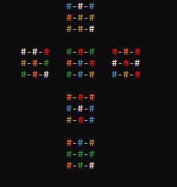
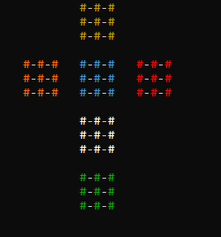

## Rubiks cube solver

Program takes __rubiks cube notation__ as an input, and mixes the cube.

After getting any input from the user program displays solved rubiks cube.  
There is a way to see **each step** of the solution.

### About

Project uses basic __C++__ and utilizes colored printing using virtual terminal.  
The algorithm used to solve the cube is __LBL__ _(layer by layer)_
